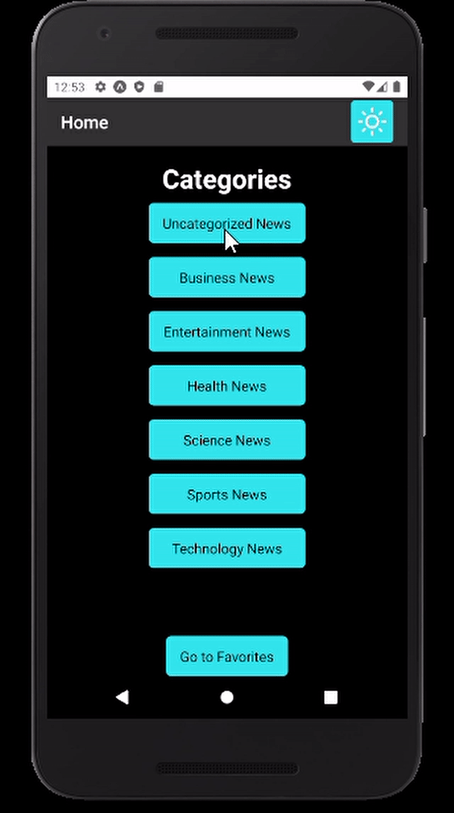
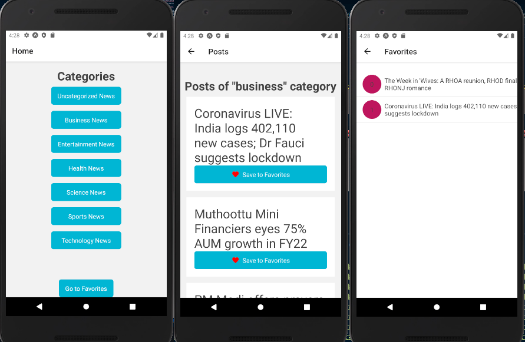

## my-news-app
A cross platform (iOS and Android) React Native news app  

# About This Project
This project purpose was a tech assignment for one of companies i applyed to

# Requirements

# Tech Stack
* React-Native  - because it is cool (and also it was a requirement)
* Expo - because i wanted to play with this interesting tool  
* Yarn - because of popular song "forever yarn"
* react-query -  because it makes code much shorter and readable

### Installation
you need to have android studio or xcode installed on your machine 
- `git clone https://github.com/shootermv/my-news-app.git`
- `yarn install`
- `(cd ios && pod install)`
- `yarn add -g expo-cli`
### How To Run
create `.env` file at root directory  
place following text at the file:  
```  
API_KEY=your-mediastack-key  
FB_APP_KEY=your-fb-app-key  
```  
run the project on your device 
```yarn android``` or ```yarn ios```

# Basic Look Of Screens
